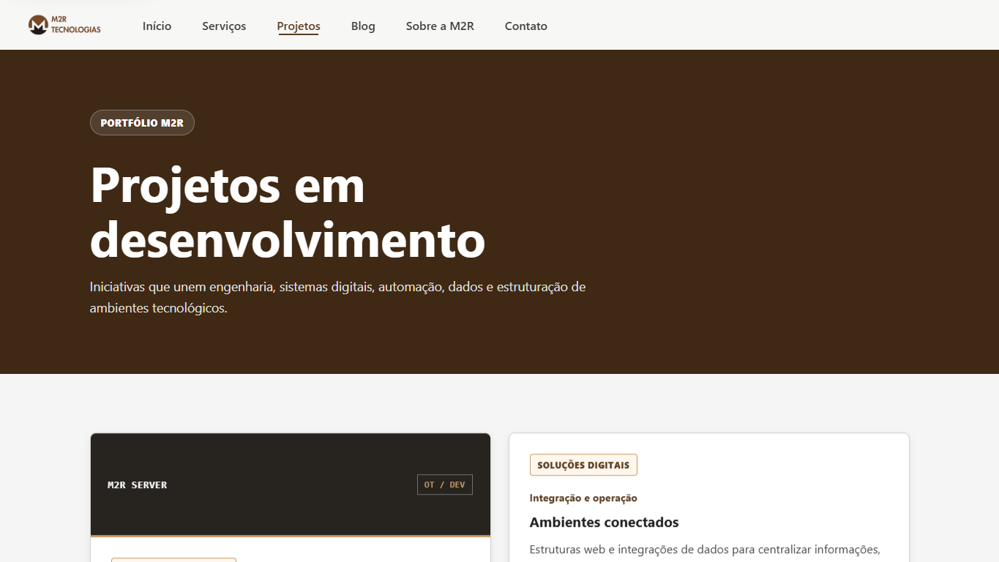
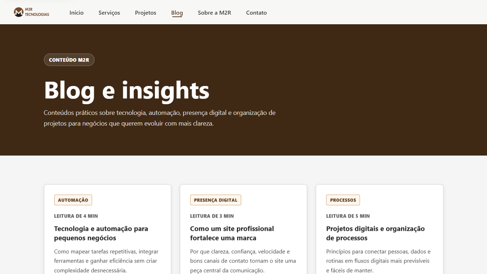

# M2R Tecnologias

[](https://m2rtecnologias.vercel.app/)
[](https://developer.mozilla.org/docs/Web/HTML)
[](https://developer.mozilla.org/docs/Web/CSS)
[](https://developer.mozilla.org/docs/Web/JavaScript)
[](LICENSE)

Site institucional da M2R Tecnologias, criado para apresentar servicos, projetos, conteudos, informacoes sobre a empresa e canais de contato.

O projeto esta organizado para publicacao simples no GitHub e deploy do frontend pela Vercel. O backend Flask e opcional e pode ser usado para status, health check e validacao simples de dados de contato.

## Visao geral

- Site multipaginas em HTML, CSS e JavaScript.
- Frontend estatico dentro da pasta `frontend/`.
- Backend Flask separado dentro da pasta `backend/`.
- Rotas limpas configuradas no `vercel.json`.
- Pagina `404.html` personalizada com fallback nativo de erro 404 na Vercel.
- `robots.txt` e `sitemap.xml` preparados para publicacao.
- Formulario de contato sem login, sem usuario de e-mail, sem senha e sem SMTP.
- Fonte de sistema para evitar dependencia externa de carregamento.
- Imagens da marca otimizadas e com dimensoes declaradas no HTML.
- Melhorias de acessibilidade com foco visivel, link para pular ao conteudo e menu ativo com `aria-current`.

## Links

- Site publicado: [https://m2rtecnologias.vercel.app/](https://m2rtecnologias.vercel.app/)
- Repositorio GitHub: [https://github.com/Marciorochar/M2R_tecnologias](https://github.com/Marciorochar/M2R_tecnologias)
- Sitemap: [https://m2rtecnologias.vercel.app/sitemap.xml](https://m2rtecnologias.vercel.app/sitemap.xml)
- Robots: [https://m2rtecnologias.vercel.app/robots.txt](https://m2rtecnologias.vercel.app/robots.txt)

## Prints do site

### Pagina inicial


### Projetos



### Blog



## Paginas do site

| Pagina | Arquivo | Rota no deploy |
| --- | --- | --- |
| Inicio | `frontend/index.html` | `/` |
| Servicos | `frontend/pages/servicos.html` | `/servicos` |
| Projetos | `frontend/pages/projetos.html` | `/projetos` |
| M2R Server | `frontend/pages/projetos/m2r-server.html` | `/projetos/m2r-server` |
| Blog | `frontend/pages/blog.html` | `/blog` |
| Artigo: Automacao para pequenos negocios | `frontend/pages/blog/automacao-para-pequenos-negocios.html` | `/blog/automacao-para-pequenos-negocios` |
| Artigo: Site profissional fortalece marca | `frontend/pages/blog/site-profissional-fortalece-marca.html` | `/blog/site-profissional-fortalece-marca` |
| Artigo: Organizacao de processos digitais | `frontend/pages/blog/organizacao-de-processos-digitais.html` | `/blog/organizacao-de-processos-digitais` |
| Sobre | `frontend/pages/sobre.html` | `/sobre` |
| Contato | `frontend/pages/contato.html` | `/contato` |
| Erro 404 | `404.html` e `frontend/404.html` | `/404` e rotas inexistentes |

## Tecnologias

### Frontend

- HTML5
- CSS3
- JavaScript puro
- Layout responsivo
- Menu mobile
- Animacoes leves com `IntersectionObserver`

### Backend

- Python
- Flask
- Flask-Cors
- Flask-Limiter
- Gunicorn
- python-dotenv

## Estrutura do projeto

```text
M2R/
  404.html
  frontend/
    index.html
    404.html
    robots.txt
    sitemap.xml
    assets/
      css/
        style.css
      js/
        script.js
      img/
        logo.png
        m2r.png
        og-image.png
    pages/
      servicos.html
      projetos.html
      projetos/
        m2r-server.html
      blog.html
      blog/
        automacao-para-pequenos-negocios.html
        site-profissional-fortalece-marca.html
        organizacao-de-processos-digitais.html
      sobre.html
      contato.html
  backend/
    app.py
    requirements.txt
    .env.example
  docs/
    screenshots/
      home.png
      projetos.png
      blog.png
  .gitignore
  CHANGELOG.md
  LICENSE
  README.md
  render.yaml
  vercel.json
```

## Como rodar o frontend localmente

Entre na pasta `frontend` e inicie um servidor estatico:

```powershell
cd frontend
python -m http.server 5500 --bind 127.0.0.1
```

Depois acesse:

```text
http://127.0.0.1:5500/
```

Tambem e possivel abrir `frontend/index.html` com o Live Server do VS Code. As rotas limpas, como `/servicos` e `/contato`, sao resolvidas no deploy pela configuracao do `vercel.json`.

## Como rodar o backend localmente

```powershell
cd backend
python -m pip install -r requirements.txt
python app.py
```

Rotas disponiveis:

| Metodo | Rota | Uso |
| --- | --- | --- |
| GET | `/` | Mensagem de status |
| GET | `/healthz` | Health check |
| GET | `/api/status` | Status da API |
| POST | `/api/contato` | Validacao simples dos dados de contato |

Variavel opcional:

```text
FRONTEND_URL=https://m2rtecnologias.vercel.app
```

## Contato

O formulario da pagina de contato usa `mailto:` para abrir o aplicativo de e-mail do visitante com a mensagem preenchida.
O site tambem possui link direto para WhatsApp com mensagem pre-preenchida e CTA fixo discreto no mobile.

Nao e necessario configurar:

- usuario de e-mail;
- senha de e-mail;
- SMTP;
- Gmail;
- banco de dados.

## Deploy na Vercel

Configuracao recomendada:

```text
Root Directory:
raiz do repositorio

Framework Preset:
Other

Build Command:
deixar vazio

Output Directory:
deixar vazio
```

O arquivo `vercel.json` faz o roteamento da raiz do projeto para os arquivos dentro de `frontend/`.
A pagina `404.html` na raiz e usada pela Vercel como fallback nativo para rotas inexistentes, preservando o status HTTP 404.

Rotas configuradas:

- `/`
- `/servicos`
- `/projetos`
- `/projetos/m2r-server`
- `/blog`
- `/blog/automacao-para-pequenos-negocios`
- `/blog/site-profissional-fortalece-marca`
- `/blog/organizacao-de-processos-digitais`
- `/sobre`
- `/contato`
- `/404`
- `/robots.txt`
- `/sitemap.xml`

Tambem ha redirecionamentos para URLs antigas, como `/index.html` e `/pages/contato.html`.
Rotas inexistentes nao usam rewrite generico; elas caem no 404 nativo da Vercel.

## Deploy do backend no Render

O backend pode ser publicado pelo `render.yaml` na raiz do projeto ou configurado manualmente:

```text
Root Directory:
backend

Build Command:
pip install -r requirements.txt

Start Command:
gunicorn app:app --bind 0.0.0.0:$PORT

Health Check Path:
/healthz
```

Nao configure usuario ou senha de e-mail no Render.

## Validacao antes de publicar

Use estes comandos antes de fazer commit:

```powershell
python -m py_compile backend/app.py
node --check frontend/assets/js/script.js
git status
```

Depois, envie para o GitHub:

```powershell
git add .
git commit -m "Atualiza projeto M2R"
git push origin main
```

## Checklist de publicacao

- Conferir se a pagina inicial abre corretamente.
- Conferir se as rotas limpas funcionam.
- Testar menu mobile.
- Testar o formulario abrindo o aplicativo de e-mail.
- Conferir `/404` e uma rota inexistente com status HTTP 404 no deploy.
- Conferir `/robots.txt`.
- Conferir `/sitemap.xml`.
- Se o backend for publicado, testar `/healthz`.

## Status atual

Projeto preparado para publicacao do frontend na Vercel e versionamento pelo GitHub.
